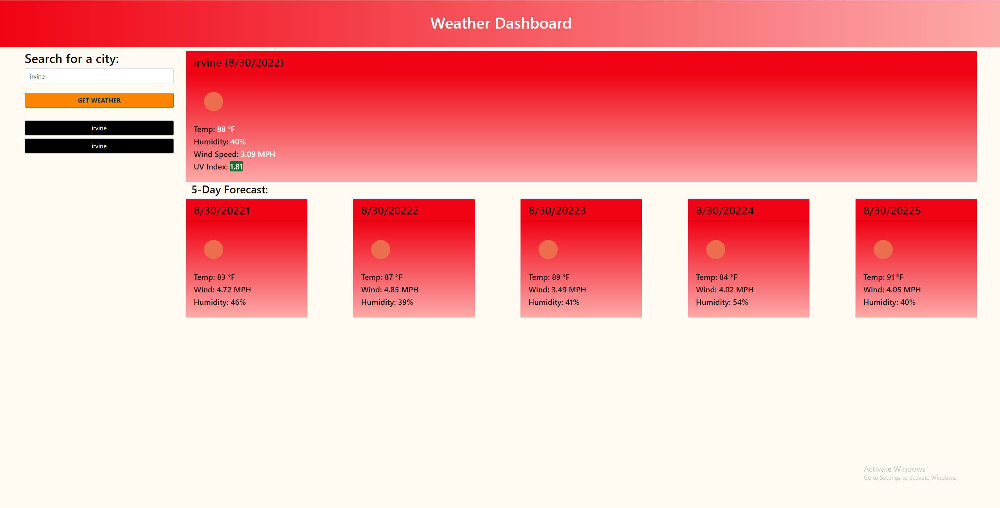

# Weather Dashboard
6 Server Side API
## Description
A **weather dashboard** that will run in the browser and feature dynamically updated HTML and CSS using the [OpenWeather One Call API](https://openweathermap.org/api/one-call-api) and using `localStorage` to store any persistant data.

## Table of Contents:
* [Installation](#installation)
* [Usage](#usage)
* [Questions](#questions)

## Usage:
Application Preview
[Link to deployed Application!](https://keeezy.github.io/06-Server-Side-APIs/)

## Questions:
If there are questions you can reach me via github/email. Listed below
- https://github.com/keeezy
- lazarokev@gmail.com 